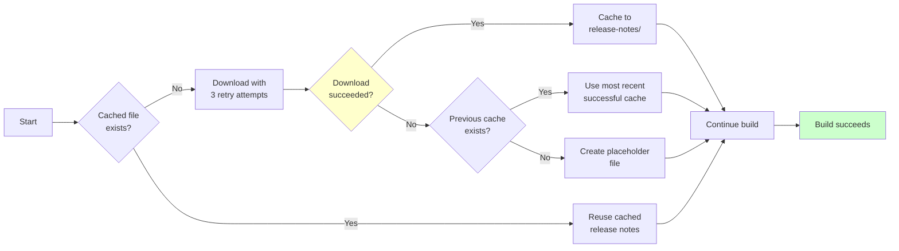

# Reproducible TeamCity Build

A production-ready project demonstrating how to create byte-for-byte reproducible documentation builds in TeamCity using Kotlin DSL configuration.

## What It Does

This project generates Javadoc and packages it into a reproducible archive (`docs.tar.gz`) that produces the same checksum every time, regardless of when or where you build it.

The build also fetches release notes from an external website, but caches them by commit hash so builds remain reproducible even if the website changes or goes down.

## Quick Start

**Build locally:**
```bash
# Generate Javadoc
mvn clean javadoc:javadoc

# Fetch release notes (replace 'abc123' with actual commit hash)
MARKETING_URL=https://example.com/releases.txt ./scripts/fetch_release_notes.sh abc123

# Create archive
./scripts/create_archive.sh abc123

# Verify checksum
sha256sum docs.tar.gz
```

**Run with TeamCity:**
```bash
# Start TeamCity server and agent
docker-compose up -d

# Open http://localhost:8111 and follow setup wizard
# The Kotlin DSL configuration will be automatically loaded from .teamcity/

# To run the test suite
docker compose --profile test run --rm test
```

## Strategy

The build implements a sophisticated caching strategy with retry logic and fallback mechanisms:



**Key Features:**
- **Step A**: Check if `release_notes_<hash>.txt` exists in the persistent cache
- **Step B** (Cache Hit): Use the cached file for reproducibility
- **Step C** (Cache Miss): Download from marketing website with retry logic (3 attempts)
- **Step D** (Robustness Fallback): If download fails, use the most recent successful cache
- **Step E** (Ultimate Fallback): If no cache exists, create a placeholder to prevent build failure

## How Reproducibility Works

The build produces identical outputs by implementing multiple reproducibility techniques:

### 1. Fixed Timestamps
- All files use a fixed modification time: `1980-01-01 00:00:00`
- Maven build uses `project.build.outputTimestamp` setting in `pom.xml`
- Archive creation normalizes all timestamps before packaging

### 2. Deterministic Ordering
- Files are sorted alphabetically in the archive using `tar --sort=name`
- Ensures consistent file ordering across builds

### 3. Fixed Ownership and Permissions
- All files use owner=0, group=0 (root)
- Numeric IDs are used instead of names (`--numeric-owner`)
- Prevents variations due to different user environments

### 4. Consistent Build Environment
- Docker ensures fixed Maven and JDK versions
- Isolated build environment prevents system-level variations
- Dependencies are cached for consistency

### 5. External Content Caching
- Release notes are cached by commit hash
- Once downloaded, the same version is always used for that commit
- Prevents changes from affecting reproducibility

**Configuration Files:**
- `pom.xml`: `project.build.outputTimestamp` property
- `scripts/create_archive.sh`: tar flags for reproducibility
- `Dockerfile`: Fixed tool versions

**Verification:**
Run the same build twice and compare SHA256 checksums - they should be identical.

## Project Structure

```
├── .teamcity/                  # TeamCity Kotlin DSL Configuration
│   ├── settings.kts           # Entry point for TeamCity DSL
│   ├── Project.kt             # Project and VCS root configuration
│   ├── DocsBuild.kt           # Build configuration with steps
│   └── pom.xml                # Maven POM for Kotlin DSL compilation
├── Dockerfile                 # Build environment (Maven + JDK 21)
├── Dockerfile.test            # Test environment
├── docker-compose.yml         # TeamCity server, agent, and database
├── pom.xml                    # Maven project configuration
├── src/main/java/             # Sample Java code for Javadoc
├── scripts/
│   ├── fetch_release_notes.sh # Downloads and caches release notes
│   └── create_archive.sh      # Creates reproducible tar.gz archive
└── test.sh                    # Integration test suite
```

## TeamCity Configuration

The project uses TeamCity Kotlin DSL for version-controlled build configuration.

**Key Features:**
- **Package Declaration**: Proper Kotlin package structure (`_Self`)
- **Parameterized Builds**: Marketing URL and other settings configurable
- **Agent Requirements**: Enforces Docker, Maven, and disk space requirements
- **Build Failure Conditions**: Timeout limits and error detection
- **Cleanup Policy**: Automatic artifact cleanup after 30 days
- **VCS Triggers**: Automatic builds on all branches and tags

**Important Parameters:**
- `MARKETING_URL`: URL to fetch release notes from (default: https://example.com)
- `RELEASE_NOTES_CACHE_DIR`: Cache directory location (default: `~/.cache/jtb-task/release-notes`)
- `commit.hash`: Automatically populated by TeamCity with `%build.vcs.number%`

**Build Steps:**
1. Install Build Tools (Maven, Java)
2. Fetch Release Notes (with graceful failure handling)
3. Build Docker Image (for consistent environment)
4. Generate Javadoc (using Maven)
5. Create Reproducible Archive (with checksum verification)

## Bash Scripts

Both scripts follow modern bash best practices:

### fetch_release_notes.sh
**Features:**
- Usage/help message with examples
- Input validation and proper error messages
- Retry logic with exponential backoff (3 attempts)
- Graceful fallback to previous successful cache
- Proper exit codes (0 for success, 1 for invalid usage)
- Structured logging (INFO/WARN/ERROR levels)
- Atomic file operations (temp file + move)
- Signal handling and cleanup

**Usage:**
```bash
MARKETING_URL=https://example.com/releases.txt ./scripts/fetch_release_notes.sh abc123
```

**Environment Variables:**
- `MARKETING_URL` (required): URL to fetch release notes from
- `RELEASE_NOTES_CACHE_DIR` (optional): Cache directory location

### create_archive.sh
**Features:**
- Usage/help message with requirements
- Prerequisite validation (checks for required tools)
- Input validation and descriptive error messages
- Reproducibility guarantees (fixed timestamps, sorted files)
- Comprehensive logging and progress updates
- Automatic cleanup of temporary files
- SHA256 checksum verification

**Usage:**
```bash
./scripts/create_archive.sh abc123
```

**Requirements:**
- GNU tar with `--sort` support (version 1.28+)
- Maven Javadoc already generated
- Standard Unix tools (find, touch, sha256sum)

## Troubleshooting

**Different checksums?**
- Ensure you're using the same commit hash
- Verify the same cached release notes file exists
- Check that you're using GNU tar with --sort support
- Confirm Maven's `project.build.outputTimestamp` is set

**Docker not found in TeamCity?**
- The agent needs Docker access
- Check that `/var/run/docker.sock` is mounted in `docker-compose.yml`
- Verify agent has Docker in Docker (DinD) enabled

**Script errors?**
- Run scripts with `-x` flag for debugging: `bash -x scripts/fetch_release_notes.sh`
- Check that MARKETING_URL environment variable is set
- Verify internet connectivity (if downloading fresh release notes)
- Ensure scripts are executable: `chmod +x scripts/*.sh`

**TeamCity DSL validation errors?**
- Verify Kotlin package declarations are correct
- Check that TeamCity server version matches DSL version (2025.11)
- Review TeamCity logs for specific error messages

## Best Practices Implemented

### TeamCity DSL
✅ Package declarations for proper namespace isolation  
✅ Parameterized configuration for flexibility  
✅ Build agent requirements to ensure proper environment  
✅ Failure conditions for early error detection  
✅ Cleanup policies to manage disk space  
✅ VCS triggers for automation  
✅ Proper use of TeamCity parameters and references  

### Bash Scripting
✅ `set -euo pipefail` for strict error handling  
✅ Input validation with descriptive errors  
✅ Usage/help messages  
✅ Structured logging (INFO/WARN/ERROR)  
✅ Readonly variables for constants  
✅ Atomic file operations  
✅ Proper cleanup and signal handling  
✅ Exit codes following Unix conventions  
✅ ShellCheck-compliant code  

### Reproducible Builds
✅ Fixed timestamps for all artifacts  
✅ Deterministic file ordering  
✅ Fixed ownership and permissions  
✅ Containerized build environment  
✅ External dependency caching  
✅ Version pinning for tools  

## References

- [TeamCity Kotlin DSL Documentation](https://www.jetbrains.com/help/teamcity/kotlin-dsl.html)
- [Reproducible Builds](https://reproducible-builds.org/)
- [Google Shell Style Guide](https://google.github.io/styleguide/shellguide.html)
- [Maven Reproducible Builds](https://maven.apache.org/guides/mini/guide-reproducible-builds.html)