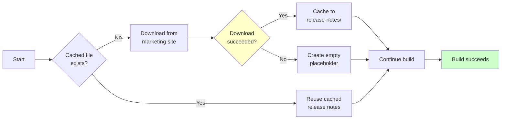

# Reproducible TeamCity Build

A demo project showing how to create reproducible documentation builds in TeamCity.

## What It Does

This project generates Javadoc and packages it into a reproducible archive (`docs.tar.gz`) that produces the same checksum every time, regardless of when or where you build it.

The build also fetches release notes from an external website, but caches them by commit hash so builds remain reproducible even if the website changes or goes down.

## Quick Start

**Build locally:**
```bash
# Generate Javadoc
mvn clean javadoc:javadoc

# Create archive (replace 'abc123' with actual commit hash)
./scripts/fetch_release_notes.sh abc123
./scripts/create_archive.sh abc123

# Verify checksum
sha256sum docs.tar.gz
```

**Run with TeamCity:**
```bash
docker-compose up -d
# Open http://localhost:8111 and follow setup wizard

# To run the test
docker compose --profile test run --rm test
```

## Strategy



- Step A: Check if release_notes_<hash>.txt exists in the Persistent Cache.
- Step B (Cache Hit): Use the cached file. This ensures the build is reproducible (even if the website changed, we use the version from the first build)
- Step C (Cache Miss): Try to curl the website.
- Step D (Robustness Fallback): If the website is down and the cache is empty, the script looks for the latest available note in the cache to avoid a build failure.

## How Reproducibility Works

The build produces identical outputs by:
- Using fixed timestamps (1980-01-01) for all files
- Sorting files alphabetically in the archive
- Running in Docker with fixed Maven/JDK versions
- Caching external content (release notes) by commit hash

Check `pom.xml` for the `project.build.outputTimestamp` setting and `scripts/create_archive.sh` for tar flags.

## Project Structure

```
├── Dockerfile              # Build environment
├── docker-compose.yml      # TeamCity setup
├── pom.xml                 # Maven config
├── src/main/java/          # Sample Java code
└── scripts/
    ├── fetch_release_notes.sh
    └── create_archive.sh
```

## Troubleshooting

**Different checksums?** Make sure you're using the same commit hash and the same cached release notes file exists.

**Docker not found in TeamCity?** The agent needs Docker access. Check that `/var/run/docker.sock` is mounted in `docker-compose.yml`.