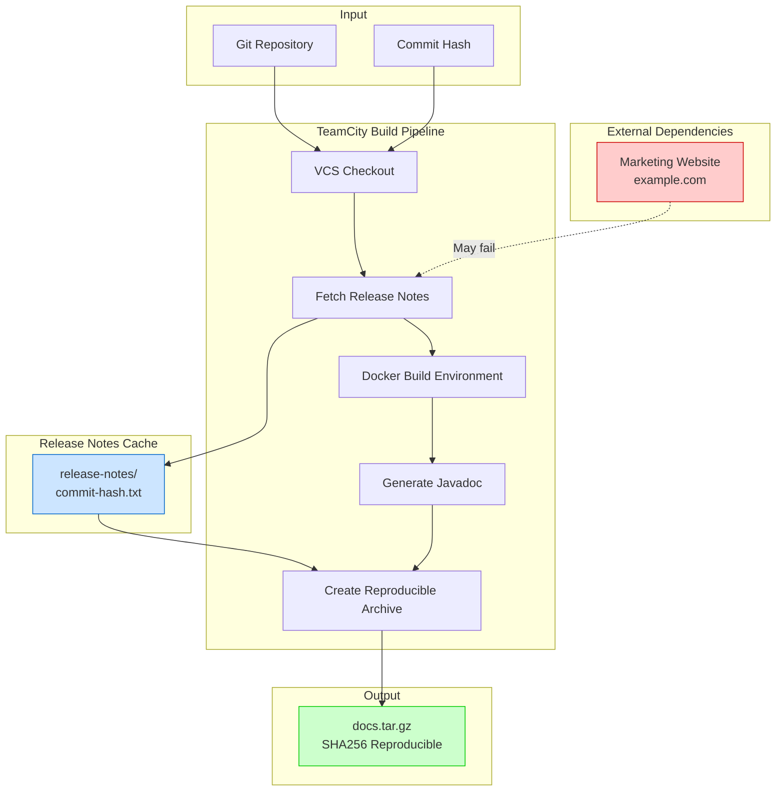
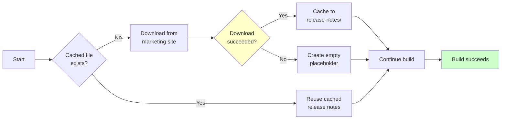

# Reproducible TeamCity Build

A production-quality solution for automating documentation release pipelines using TeamCity with byte-for-byte reproducible builds.

## Architecture Overview

This project demonstrates a reproducible build pipeline that:

1. **Accepts only a Git commit hash** as the build input
2. **Generates Javadoc** from a Maven Java project
3. **Fetches external release notes** with graceful failure handling
4. **Produces a byte-for-byte reproducible archive** regardless of build time or environment



## Reproducibility Guarantees

This solution ensures byte-for-byte identical archives through:

| Technique | Purpose |
|-----------|---------|
| **Fixed Timestamps** | All files use `1980-01-01 00:00:00 UTC` via `project.build.outputTimestamp` and `--mtime` |
| **Sorted File Order** | Files are added to the archive in deterministic sorted order using `find | sort` |
| **Fixed Ownership** | All files have `root:root` ownership via `--owner=0 --group=0` |
| **Docker Environment** | Consistent JDK and Maven versions across all builds |
| **Snapshot Release Notes** | External content is cached per commit hash |
| **Non-interactive Maven** | Uses `-B` flag to prevent terminal-dependent output |

## Release Notes Snapshotting

The build handles the unreliable marketing website gracefully:



**Key behaviors:**
- If `release-notes/{commit-hash}.txt` exists, it is reused (snapshot)
- If the marketing site is available, content is downloaded and cached
- If the marketing site is unavailable, an empty placeholder file is created
- **The build never fails due to network errors**

## Project Structure

```
reproducible-teamcity-build/
├── README.md                    # This documentation
├── docker-compose.yml           # TeamCity server + agent
├── Dockerfile                   # Reproducible build environment
├── pom.xml                      # Maven project with Javadoc
├── scripts/
│   ├── fetch_release_notes.sh   # Download with fallback
│   └── create_archive.sh        # Reproducible tar.gz creation
├── release-notes/
│   └── .gitkeep                 # Cached release notes per commit
├── src/main/java/com/example/
│   └── App.java                 # Sample Java source
└── .teamcity/
    ├── settings.kts             # Kotlin DSL entry point
    ├── Project.kt               # Project definition
    └── DocsBuild.kt ose
- Git

### 1. Start TeamCity

```bash
docker-compose up -d
```

Wait for TeamCity to initialize (first run takes a few minutes):

```bash
# Check server logs
docker-compose logs -f teamcity-server

# Server will be ready when you see "TeamCity initialized"
```

### 2. Access TeamCity

1. Open http://localhost:8111
2. Complete the setup wizard (accept license, create admin user)
3. The project will be automatically imported from `.teamcity/` settings

### 3. Configure VCS Root

1. Go to **Administration** → **Projects** → **Reproducible Docs Build**
2. Edit the VCS Root to point to your Git repository
3. Ensure the checkout rules include the entire repository

### 4. Run a Build

1. Click **Run** on the build configuration
2. The build will:
   - Checkout the specified commit
   - Fetch release notes (or use cached/empty fallback)
   - Build Javadoc in Docker
   - Create a reproducible archive
3. Download `docs.tar.gz` from the artifacts

## Verifying Reproducibility

### Run the Same Build Twice

``h
# First build
./scripts/fetch_release_notes.sh abc123
docker build -t docs-builder .
docker run --rm -v "$(pwd)":/workspace -w /workspace docs-builder mvn clean javadoc:javadoc -B
./scripts/create_archive.sh abc123
sha256sum docs.tar.gz
# Example: a1b2c3d4e5f6... docs.tar.gz

# Wait, then run again with same commit hash
./scripts/create_archive.sh abc123
sha256sum docs.tar.gz
# Example: a1b2c3d4e5f6... docs.tar.gz (IDENTICAL)
```

### Compare Builds on Different Machines

```bash
# Machine A
./scripts/create_archive.sh abc123
sha256sum docs.tar.gz > checksum-a.txt

# Machine B (same commit, same cached release notes)
./scripts/create_archive.sh abc123
sha256sum docs.tar.gz > checksum-b.txt

# Compare
diff checksum-a.txt checksum-b.txt  # Should be empty (identical)
```

### Inspect Archive Contents

```bash
# List contents with metadata
tar -tzvf docs.tar.gz

# All entries should show:
# - Timestamp: 1980-01-01 00:00
# - Owner: root/root (0/0)
# - Sorted alphabetically
```

## Configuration Options

### Environment Variables

| Variable | Default | Description |
|----------|---------|-------------|
| `MARKETING_URL` | `https://example.com` | URL for release notes |
| `COMMIT_HASH` | `unknown` | Git commit hash for caching |
| `BUILD_TIMESTAMP` | `1980-01-01T00:00:00Z` | Fixed timestamp for reproducibility |

### Maven Properties

| Property | Value | Purpose |
|----------|-------|---------|
| `project.build.outputTimestamp` | `1980-01-01T00:00:00Z` | Reproducible JAR timestamps |
| `maven.compiler.source` | `17` | Java source version |
| `maven.compiler.target` | `17` | Java target version |

## Troubleshooting

### Build fails with "Docker not found"

Ensure Docker is installed and the TeamCity agent has access to the Docker socket:

```bash
# Check Docker access
docker ps

# If using Docker-in-Docker, ensure the agent mounts /var/run/docker.sock
```

### Release notes download fails

This is expected behavior when the marketing site is unavailable. The build will:
1. Create an empty `release-notes/{commit}.txt`
2. Continue with the build
3. Produce a valid archive

Check the cached file:
```bash
cat release-notes/{commit-hash}.txt
```

### Archive checksums differ

Verify:
1. Same commit hash is used
2. Same release notes file exists (or both are empty)
3. Docker image is the same version
4. No local modifications to source files

```bash
# Check git status
git status

# Verify release notes cache
ls -la release-notes/
```

## Technical Details

### How Reproducibility Works

1. **Maven Output Timestamp**: The `project.build.outputTimestamp` property ensures all generated files have the same modification time.

2. **Tar Archive Flags**:
   ```bash
   tar --sort=name \
       --mtime="1980-01-01 00:00:00" \
       --owner=0 --group=0 \
       --numeric-owner \
       -czf docs.tar.gz ...
   ```

3. **Docker Isolation**: The Docker container provides a consistent filesystem and toolchain, eliminating host-specific variations.

4. **Deterministic File Discovery**: Files are discovered with `find` and sorted before archiving.

### Security Considerations

- The marketing URL is treated as untrusted external input
- Downloaded content is cached locally
- Empty fallback prevents build manipulation via DoS
- Docker provides isolation from the host system

## License

MIT License - See LICENSE file for details.
