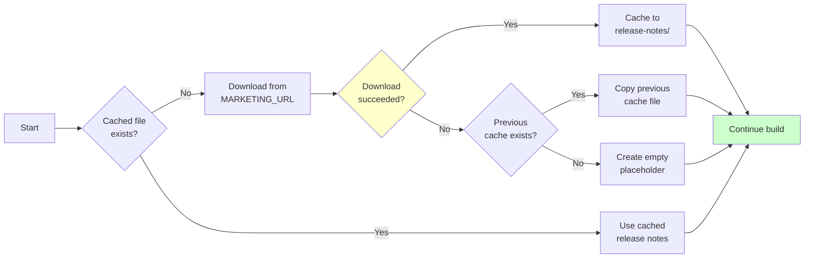

# Reproducible Documentation Build

A TeamCity project that generates Javadoc and packages it into a **byte-for-byte reproducible** archive.

## What It Does

1. Extracts commit timestamp from git
2. Fetches release notes from external URL (with caching/fallback)
3. Generates Javadoc with reproducible timestamps
4. Creates `docs.tar.gz` archive with identical checksum for same commit

## TeamCity Setup

**Required parameter:**
- `env.MARKETING_URL` - URL to fetch release notes from

Configure in Project settings or pass at build time.

## Build Steps

| Step | Runner | Purpose |
|------|--------|---------|
| Get Commit Timestamp | Script | Extract git commit time |
| Fetch Release Notes | Script (Alpine) | Download/cache release notes |
| Generate Javadoc | Maven | Build documentation |
| Create Archive | Script (Alpine) | Package reproducible tar.gz |

## How Reproducibility Works

- **Commit timestamp** used for all file mtimes (from `git log --format='%cI'`)
- **Maven** uses `-Dproject.build.outputTimestamp` for reproducible output
- **tar** uses `--sort=name --mtime --owner=0 --group=0 --numeric-owner`
- **Release notes** cached by commit hash (survives external URL changes)

## Release Notes Caching Strategy



## Local Testing

```bash
# Generate Javadoc
mvn clean javadoc:javadoc

# Fetch release notes
export MARKETING_URL=https://example.com/releases.txt
export RELEASE_NOTES_CACHE_DIR=./cache
./scripts/fetch_release_notes.sh $(git rev-parse HEAD)

# Create archive (needs GNU tar - use Docker on macOS)
docker run --rm -v "$PWD:/workspace" -w /workspace \
  -e RELEASE_NOTES_CACHE_DIR=./cache \
  alpine:3.19 sh -c "apk add tar && sh scripts/create_archive.sh $(git rev-parse HEAD) $(git log -1 --format='%cI')"

# Verify
sha256sum docs.tar.gz
```

## Fallback Behavior

If `MARKETING_URL` download fails:
1. Use most recent cached release notes file
2. Or create empty placeholder

Build continues either way - release notes are supplementary content.
