# Jetbrains Task - Build and Release Documentation

Automate a manual process of building and releasing documentation.

<details>
<summary>Task description</summary>

### Manual process

- Runs mvn javadoc to generate documentation
- Downloads release notes from a marketing website.
- Archives everything.
- Submits the archive to QA.

### Assignment: Automated process

- Automate the manual process using TeamCity.
- TeamCity only gets a commit hash as a parameter.
  - Build must be reproducible: same commit hash should produce identical archive.
  - Do not fail the build if the marketing website is unavailable.
  - Use Kotlin DSL for TeamCity configuration.
- Provide a README with instructions on how to run TeamCity and verify the build.

</details>

## Solution

- Release notes are downloaded **once per commit**
- Stored as TeamCity artifacts and Reused for future builds.
- This means your script cannot use git pull inside the build steps (as the agent already has the code). It must use the hash provided by TeamCity to verify it is working on the correct state.
- Persistent Cache (Volume): This is the key to the assignment. It stores a "pinned" copy of the release notes for every commit hash. Once a build for a specific hash is successful, the release notes for that version are "frozen" here forever.

### Hidden Factors in Reproducibility
- Timestamps: By default, Javadoc puts "Generated on Dec 20, 2025" in every HTML file.
  - SOURCE_DATE_EPOCH: This forces Maven and the ZIP utility to use the Git commit time instead of "Current Time."
- ZIP Metadata: ZIP files store the time the file was created. If you zip at 2:00 PM and again at 2:01 PM, the hashes won't match.
- File Ordering: Linux might list files in a different order on different machines. If the zip utility adds files in a different order, the hash changes.
- The Website: Since the website can change "anytime," you need a way to "pin" the version of the notes used for a specific build.

### Strategy

- Step A: Check if release_notes_<hash>.html exists in the Persistent Cache.
- Step B (Cache Hit): Use the cached file. This ensures the build is reproducible (even if the website changed, we use the version from the first build)
- Step C (Cache Miss): Try to curl the website.
- Step D (Robustness Fallback): If the website is down and the cache is empty, the script looks for the latest available note in the cache to avoid a build failure.

### How to Run

1. Start TeamCity:

```bash
docker-compose up -d
```

2. Open TeamCity UI at `http://localhost:8111`
3. Trigger build with a commit hash
4. Download `docs.tar.gz`
5. Verify:

```bash
sha256sum docs.tar.gz # Should be identical for same commit
```

## Diagram

```mermaid
---
config:
  layout: elk
---
flowchart TB
 subgraph s1["External World (Unreliable)"]
        MarketingSite[("🌐 Marketing Website")]
        QA_Team["👥 QA Team"]
  end
 subgraph s2["Source of Truth (Reliable)"]
        GitRepo[🐙 Git Repository]
 end
 subgraph s3["Dockerized Build Environment"]
        TCAgent["👷‍♂️ TeamCity Agent"]
        Maven["☕ Maven"]
        Scripts["📜 Build Scripts"]
  end
 subgraph s4["CI Infrastructure (TeamCity)"]
        TCServer["🧠 TeamCity Server"]
        s3
        CacheVolume[("💾 Persistent Cache Volume")]
  end
    GitRepo -- Trigger on push --> TCServer
    TCServer -- "1. Assign Build(Input: Commit Hash X)" --> TCAgent
    TCAgent -- "2. Checkout Code(At Hash X)" --> GitRepo
    TCAgent -- "3a. Check for existing notes" --> CacheVolume
    CacheVolume -- "3b. Return notes OR miss" --> TCAgent
    TCAgent -. "3c. Try fetch (If cache miss)" .-> MarketingSite
    TCAgent -- "4. Pin notes for Hash X" --> CacheVolume
    TCAgent -- "5. Run Build & Normalize" --> Maven
    Maven --> Scripts
    Scripts -- "6. Publish reproducible ZIP" --> TCServer
    TCServer -- "7. Download Artifact" --> QA_Team

     MarketingSite:::external
     QA_Team:::external
     GitRepo:::source
     TCAgent:::ci
     Maven:::ci
     Scripts:::ci
     TCServer:::ci
     CacheVolume:::storage
    classDef external fill:#f9f,stroke:#333,stroke-width:2px
    classDef source fill:#ccf,stroke:#333,stroke-width:2px
    classDef ci fill:#dfd,stroke:#333,stroke-width:2px
```

